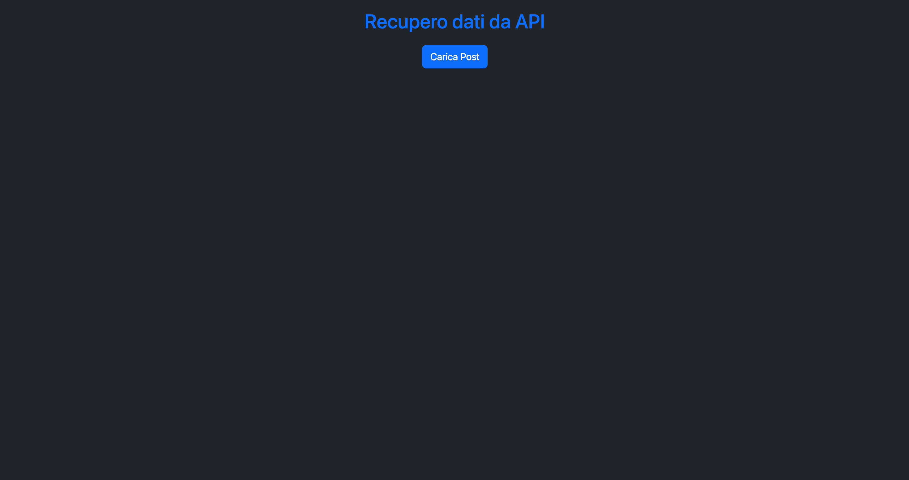
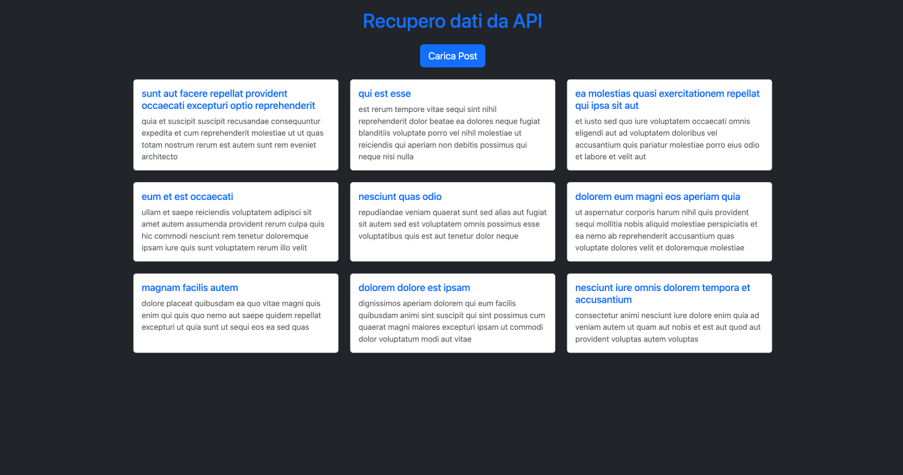

# Esercizio con API CARD 
*Novembre 2025* 👩🏻‍💻

---




---

⚒️

| Nome | Linguaggio | Versione |
|------|------------|----------|
| HTML |Markup      | 5        |
| Java |Logic       | ES7      |

---

👩🏻‍💻

```
Avviare Golive su VSCode
